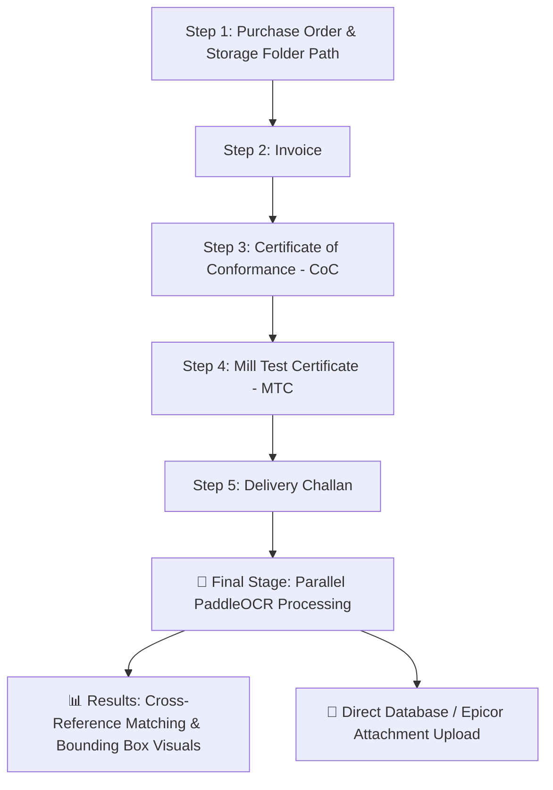
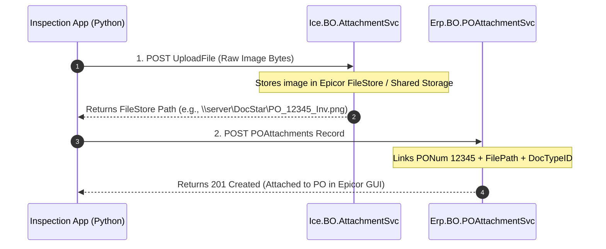

# 🏭 AI-Powered Incoming Goods Inspection & On-Premise Epicor ERP Integration Guide

---

## 📌 Executive Overview & Project Context

### 1. Project Objective
This application is an **AI-Powered Incoming Goods & Receiving Inspection System** designed for shop-floor industrial operations. It automates the verification of physical supplier documents (Invoices, Certificates of Conformance, Mill Test Certificates, Delivery Challans) against **Purchase Orders (POs)** using **PaddleOCR** and semantic document extraction.

### 2. Application Architecture & Stack
- **Frontend & Workflow Engine:** Streamlit (`ui.py`)
- **OCR Engine:** PaddleOCR (`PP-OCRv4` with PyPDFium2 rendering for PDF pages)
- **Concurrency & Performance:** Parallel batch processing using Python `concurrent.futures.ThreadPoolExecutor`
- **Data Export:** Automated Excel (`openpyxl`) and raw text (`.txt`) evidence generation
- **Execution Script:** `run_inspection_app.bat` (uses local Python 3.11 environment)

---

## ⚡ Current Workflow & Functionality (What We Have Built So Far)



### Key Workflow Features:
1. **Step-by-Step Fast Capture Flow (10–20 seconds total):**
   - Operators can upload files (`.pdf`, `.png`, `.jpg`) or snap live camera photos for each document step.
   - Images and files are saved into session storage and local disk folders **instantly** without blocking for OCR.
   - **"⏭ Skip this document"** buttons are available on both Upload and Camera tabs across all steps.
2. **Local Image Database Folder Selection:**
   - On **Step 1 (Purchase Order)**, operators specify a local folder path (e.g., `C:\Users\shailesh\Documents\InspectionImages`).
   - All clicked camera images are automatically stored with timestamped filenames (`Invoice_20260730_120000.png`).
3. **Parallel Batch OCR Execution:**
   - Once all 5 steps are complete (or skipped), the app launches a parallel thread pool (`ThreadPoolExecutor`) on the Results screen to run PaddleOCR across all collected documents simultaneously.
4. **Automated Cross-Reference & Comparison:**
   - Compares extracted PO fields (PO Number, Supplier Name, Part Numbers, Quantities) against supporting document OCR results, displaying **✅ Match**, **❌ Mismatch**, or **⚠️ Discrepancy** status.

---

## 🏢 On-Premise Epicor ERP Integration (Detailed Blueprint)

### 1. The Challenge
Epicor ERP (Kinetic / E10) is hosted on-premise inside the corporate firewall. 
- **Goal A:** Fetch real-time Purchase Order headers & line items directly from Epicor into the inspection app.
- **Goal B:** Upload captured inspection photos and document PDFs directly as **Epicor PO Attachments** instead of storing them on isolated local folders.

---

### 2. Network Topology & Connectivity Options


- **Scenario 1: Running Locally on Shop Floor (Recommended)**
  - When the app is run locally on factory PCs (`run_inspection_app.bat`), the app is on the **same LAN** as the Epicor server.
  - It communicates directly via `https://<epicor-server-ip>/<instance>/api/v2/odata/...`.
- **Scenario 2: Streamlit Cloud to On-Premise Epicor**
  - Use a secure tunnel agent (**Cloudflare Tunnel** or **ngrok**) on an internal server to route requests from Streamlit Cloud to the internal Epicor REST endpoint without exposing Epicor publicly to the open internet.

---

## 📡 Epicor REST API v2 Specifications

### A. Authentication & Headers
Epicor REST v2 requires **API Key** and **Basic Authentication** (or Bearer Token):
```http
x-api-key: YOUR_EPICOR_API_KEY
Authorization: Basic <base64(username:password)>
Accept: application/json
Content-Type: application/json
```

---

### B. Real-Time Purchase Order Fetching API

#### Endpoint:
```http
GET https://<epicor-server>/<instance>/api/v2/odata/<CompanyID>/Erp.BO.POSvc/POHeaders({PONum})?$expand=PODetails
```

#### Sample Response Payload:
```json
{
  "Company": "100",
  "PONum": 12345,
  "VendorNum": 402,
  "VendorID": "AERO_SUPPLIES",
  "TermsCode": "NET30",
  "PODetails": [
    {
      "Company": "100",
      "PONum": 12345,
      "POLine": 1,
      "PartNum": "BRKT-AL-99",
      "LineDesc": "Aluminum Bracket Aerospace Grade",
      "OrderQty": 50.0,
      "DocUnitPrice": 125.50
    }
  ]
}
```

---

### C. Direct Document Attachment to Epicor PO (Atmost Detail)

Attaching a file directly to an Epicor Purchase Order requires a **2-Step API Call Sequence**:



#### Step 1: Upload File Binary (`Ice.BO.AttachmentSvc/UploadFile`)
```http
POST https://<epicor-server>/<instance>/api/v2/odata/<CompanyID>/Ice.BO.AttachmentSvc/UploadFile
```
**Body:**
```json
{
  "parentFolderName": "Company_100\\Attachments\\PO",
  "fileName": "Invoice_12345_20260730.png",
  "data": "<base64_encoded_image_bytes>"
}
```
**Response:** Returns `value` containing the server-relative or UNC file path.

#### Step 2: Link Attachment to Purchase Order (`Erp.BO.POAttachmentSvc/POAttachments`)
```http
POST https://<epicor-server>/<instance>/api/v2/odata/<CompanyID>/Erp.BO.POAttachmentSvc/POAttachments
```
**Body:**
```json
{
  "Company": "100",
  "PONum": 12345,
  "FileName": "\\\\epicor-server\\Attachments\\Invoice_12345_20260730.png",
  "DrawNum": "Invoice",
  "DocTypeID": "PURCH",
  "ForeignSysRowID": "<POHeader_SysRowID_GUID>",
  "CommentText": "Captured via AI Goods Inspection App"
}
```

---

## 🐍 Complete Production Python Integration Module (`epicor.py`)

You can drop this module directly into your codebase to handle all Epicor interactions:

```python
"""
epicor.py - On-Premise Epicor ERP REST v2 Integration Module
Handles real-time PO lookup and direct file attachment uploads.
"""

import requests
import base64
import urllib3

# Suppress self-signed SSL warnings if Epicor uses internal SSL certificates
urllib3.disable_warnings(urllib3.exceptions.InsecureRequestWarning)

class EpicorClient:
    def __init__(self, server_url: str, company: str, api_key: str, username: str, password: str, verify_ssl: bool = False):
        self.server_url = server_url.rstrip('/')
        self.company = company
        self.api_key = api_key
        self.auth = (username, password)
        self.verify_ssl = verify_ssl
        self.headers = {
            "x-api-key": api_key,
            "Accept": "application/json",
            "Content-Type": "application/json"
        }

    def fetch_po(self, po_num: int) -> dict:
        """Fetch PO Header and Line Details live from Epicor ERP."""
        endpoint = f"{self.server_url}/api/v2/odata/{self.company}/Erp.BO.POSvc/POHeaders({po_num})?$expand=PODetails"
        
        response = requests.get(
            endpoint,
            headers=self.headers,
            auth=self.auth,
            verify=self.verify_ssl
        )
        
        if response.status_code == 200:
            data = response.json()
            return {
                "po_number": data.get("PONum"),
                "vendor_id": data.get("VendorID"),
                "vendor_num": data.get("VendorNum"),
                "order_date": data.get("OrderDate"),
                "sys_row_id": data.get("SysRowID"),
                "lines": [
                    {
                        "line_num": line.get("POLine"),
                        "part_num": line.get("PartNum"),
                        "description": line.get("LineDesc"),
                        "order_qty": float(line.get("OrderQty", 0)),
                        "unit_price": float(line.get("DocUnitPrice", 0)),
                    }
                    for line in data.get("PODetails", [])
                ]
            }
        else:
            raise RuntimeError(f"Epicor PO Fetch Error ({response.status_code}): {response.text}")

    def upload_po_attachment(self, po_num: int, file_bytes: bytes, file_name: str, doc_type: str = "INCOMING_GOODS") -> bool:
        """
        Uploads image/document bytes to Epicor and attaches record to the specified PO.
        """
        # Step 1: Base64 encode file content
        encoded_data = base64.b64encode(file_bytes).decode('utf-8')
        
        # Step 2: Upload raw file to Epicor FileStore
        upload_endpoint = f"{self.server_url}/api/v2/odata/{self.company}/Ice.BO.AttachmentSvc/UploadFile"
        upload_payload = {
            "parentFolderName": f"Company_{self.company}\\Attachments\\PO",
            "fileName": file_name,
            "data": encoded_data
        }
        
        up_res = requests.post(
            upload_endpoint,
            json=upload_payload,
            headers=self.headers,
            auth=self.auth,
            verify=self.verify_ssl
        )
        
        if up_res.status_code not in (200, 201):
            raise RuntimeError(f"Epicor File Upload Failed ({up_res.status_code}): {up_res.text}")
            
        file_store_path = up_res.json().get("value", file_name)

        # Step 3: Link attachment to PO in Erp.BO.POAttachmentSvc
        attach_endpoint = f"{self.server_url}/api/v2/odata/{self.company}/Erp.BO.POAttachmentSvc/POAttachments"
        attach_payload = {
            "Company": self.company,
            "PONum": po_num,
            "DrawNum": doc_type,
            "FileName": file_store_path,
            "DocTypeID": "PURCH",
            "CommentText": "Attached automatically by AI Incoming Goods Inspection System"
        }
        
        att_res = requests.post(
            attach_endpoint,
            json=attach_payload,
            headers=self.headers,
            auth=self.auth,
            verify=self.verify_ssl
        )
        
        return att_res.status_code in (200, 201)
```

---

## 💻 Streamlit UI Integration Snippet (`ui.py`)

Here is how the Epicor PO Fetching is wired into **Step 1 (Purchase Order)** inside Streamlit:

```python
import streamlit as st
from epicor import EpicorClient

# Initialize Epicor client credentials
EPICOR_URL = "https://epicor-server.local/Kinetic"
EPICOR_COMPANY = "100"
EPICOR_API_KEY = st.secrets.get("EPICOR_API_KEY", "your_api_key_here")

epicor = EpicorClient(
    server_url=EPICOR_URL,
    company=EPICOR_COMPANY,
    api_key=EPICOR_API_KEY,
    username="inspection_app",
    password="SecurePassword123"
)

# UI Component on Step 1:
if st.session_state.step == 0:
    st.markdown("### 🔍 Live Epicor ERP PO Lookup")
    po_input = st.number_input("Enter Epicor PO Number", min_value=1, step=1)
    
    if st.button("⚡ Fetch PO Live from Epicor"):
        with st.spinner(f"Connecting to Epicor server and fetching PO #{po_input}..."):
            try:
                po_data = epicor.fetch_po(po_input)
                st.session_state.epicor_po = po_data
                st.success(f"✅ PO #{po_data['po_number']} loaded! Vendor: {po_data['vendor_id']} ({len(po_data['lines'])} lines)")
                st.json(po_data)
            except Exception as e:
                st.error(f"Failed to fetch PO from Epicor: {e}")
```

---

## 🛠 Summary Checklist for Next Developer / AI Context
1. **Codebase Repository:** `https://github.com/ujju1234567/Store-Automation`
2. **Current State:** 
   - Fast step-by-step document wizard (PO, Invoice, CoC, MTC, Challan)
   - Step 1 asks for laptop image folder path
   - Skippable camera & upload steps
   - Parallel PaddleOCR batch execution on Results page
3. **To Connect Epicor:**
   - Add `epicor.py` to the root folder
   - Set Epicor API credentials in `.env` or Streamlit Secrets
   - Call `epicor.upload_po_attachment(...)` inside the final processing step on the Results page to stream captured files directly to Epicor.
